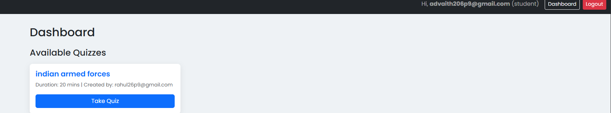

# 🧠 Quiz App  

A full-featured **Flask-based Quiz Application** built for both teachers and students.  
It allows teachers to create quizzes and manage questions, while students can take quizzes with a timer, view scores, and check leaderboards.

---

## ✨ Features
- 👨‍🏫 **Teacher Mode**
  - Create quizzes with duration.
  - Add, edit, and manage questions.
  - View leaderboard for student scores.
- 🧑‍🎓 **Student Mode**
  - Register, log in, and take quizzes.
  - One-attempt per quiz (tracked in the database).
  - View leaderboard after submission.
- 🧩 **Core Highlights**
  - Responsive UI with **Bootstrap + minimal CSS**.
  - jQuery-based **form validation** & timers.
  - Lightweight **SQLite** database using Flask-SQLAlchemy.
  - Clean structure: `/templates` for HTML, `/static` for CSS/JS.

---

## 🖼️ Screenshots

### 🏠 Homepage


### 🧾 Register Page


### 🔐 Login Page


### 🧮 Dashboard (Student View)


### 🧑‍🏫 Dashboard (Teacher View)


### 🕒 Quiz Page (With Timer)


### 🏆 Leaderboard


---

## ⚙️ Prerequisites
- **Python 3.8+**
- Works on **Windows / Linux / macOS**

---

## 🧩 Installation

Clone the repository:
```bash
git clone https://github.com/Sai-Saketh-ram-5689/Quiz-App.git
cd Quiz-App
